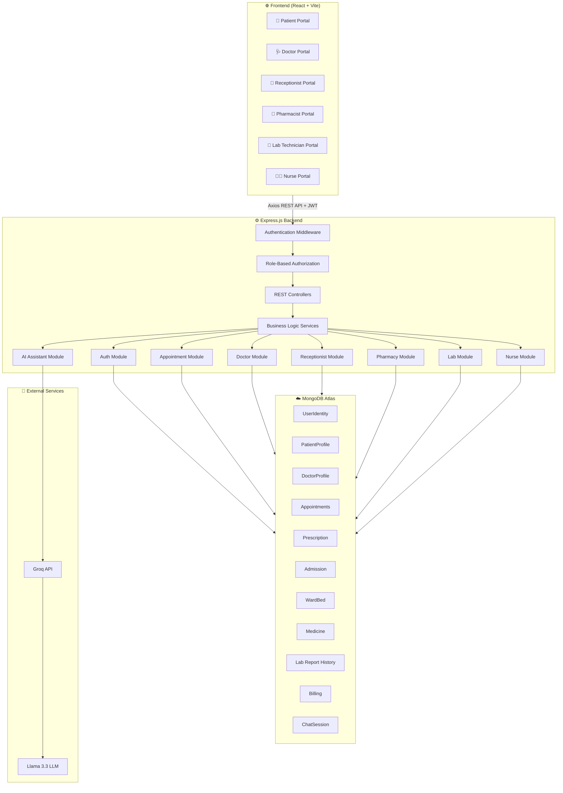
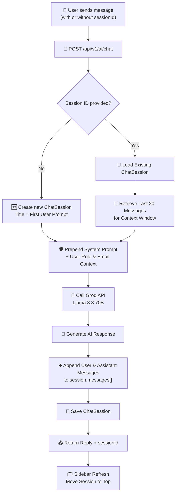

# 🏥 CareOS — Hospital Management & Operations Platform

<div align="center">


**A full-stack, role-based Hospital Management System built on the MERN stack**
*Streamlining patient care, clinical workflows, billing, and hospital operations — end to end.*

</div>

---

## 📋 Table of Contents

<details>
<summary><strong>Click to expand</strong></summary>

- [About the Project](#-about-the-project)
- [Internship & Author Details](#-internship--author-details)
- [Key Features](#-key-features)
- [Tech Stack](#-tech-stack)
- [System Architecture](#-system-architecture)
- [Workflow Diagrams](#-workflow-diagrams)
- [Project Structure](#-project-structure)
- [Folder Structure Deep Dive](#-folder-structure-deep-dive)
- [Database Schema Overview](#-database-schema-overview)
- [Getting Started](#-getting-started)
- [Environment Variables](#-environment-variables)
- [Sample API Calls](#-sample-api-calls)
- [API Reference](#-api-reference)
- [Role-Based Access Control](#-role-based-access-control)
- [Deployment](#-deployment)
- [Testing](#-testing)
- [Roadmap](#-roadmap)

</details>

---

## 📖 About the Project

**CareOS** is an industrial-grade, multi-role hospital management system engineered to digitize and optimize the complete patient care lifecycle—from initial appointment scheduling to final billing reconciliation. Built following modern product development standards, the platform features a robust service-layer architecture, RESTful API endpoints, secure JWT authentication, advanced MongoDB aggregation pipelines, and an integrated AI clinical assistant complete with persistent conversation history.

The platform supports **six distinct user roles** — Patient, Doctor, Receptionist, Pharmacist, Lab Technician, and Nurse — each with a tailored dashboard and permission set, all backed by a single unified backend.

> This project was built as part of an internship engagement to demonstrate full-stack engineering capability across backend architecture, frontend UX, database design, and deployment practices.

---

## 🎓 Internship & Author Details

| Field | Detail |
|---|---|
| **Project Name** | `CareOS Hospital Management ERP System` |
| **Author** | `Het Limbani` |
| **Role** | `MERN Stack Developer` |
| **Institution** | `Adani University` |
| **Internship Company** | [Covrize IT Solutions Private Limited](https://www.covrize.com/) |
| **Duration** | `Summer Internship  June 1, 2026` – `July 26, 2026` |
| **Live Deployment** | `<DEPLOYED_URL>` |

---

## ✨ Key Features

<details>
<summary><strong>🧑‍⚕️ Patient Module</strong></summary>

- Profile management with medical details, emergency contacts, and insurance info
- Search doctors by specialization and view live availability calendars
- Book, reschedule, and cancel appointments in real time (slot-collision safe)
- View complete prescription history with medicine and lab test breakdowns
- Track diagnostic lab report status and results
- Personal clinical dashboard — allergies, chronic conditions, vitals log
- Domain-restricted AI Assistant with persistent, per-user chat history
- Billing history tracking with insurance verification status (verified or pending) and completed billing information details

</details>

<details>
<summary><strong>🩺 Doctor Module</strong></summary>

- Profile & clinic setup (specialization, fee, qualifications, bio)
- Appointment request management (confirm/reject) with monthly calendar view
- Issue & edit e-prescriptions (medicines + lab test orders) linked to catalogs
- Full patient roster with clinical history timeline per patient
- Review completed diagnostic lab reports
- Manage inpatient ward treatment directives and admission plans

</details>

<details>
<summary><strong>💳 Receptionist Module</strong></summary>

- Visited-queue → auto-aggregated draft invoice generation (consultation + treatment + medicine + lab costs)
- Insurance coverage validation and adjustment charge handling
- Partitioned billing ledger: Unpaid / Insurance Pending / Paid / Cancelled
- Invoice status lifecycle management with payment method tracking
- Appointment management with real-time slot booking, rescheduling, and accept/reject request handling backed by automated email notifications
- Admission processing and dynamic room/bed assignment tracking
- Consultation request management handling incoming walk-in or phone schedules with automated email response dispatch

</details>

<details>
<summary><strong>💊 Pharmacist Modules</strong></summary>

- Prescription-linked medicine dispensing and pharmacy invoice generation
- Medicine inventory management with real-time stock updates, low-stock alerts, and new stock batch registration
- Comprehensive pharmacy billing history with status tracking to view paid, pending, and voided bills instantly

</details>

<details>
<summary><strong>🧪 Lab Technician Modules</strong></summary>

- Manage upcoming lab requests
- Lab test request intake, result upload, and status pipeline tracking
- Comprehensive pharmacy billing history with status tracking to view paid, pending, and voided bills instantly

</details>

<summary><strong>🧑🏼‍⚕️ Nurse Modules</strong></summary>

- Access assigned patient data including prescription record files and lab report files
- Ward management restricted to assigned patients, including tracking status such as ready for discharge
- Record and store vital logs including Blood Pressure, Heart Rate (BPM), and Temperature (°C), and view Historical Evaluation Logs
- Manage treatment plans prescribed by doctors, execute them to completion, and update treatment plan details as a nurse
</details>

<details>
<summary><strong>🤖 CareOS AI Assistant</strong></summary>

- Domain-restricted conversational assistant (hospital ops only — guardrailed system prompt)
- **Persistent chat sessions** stored per authenticated user in MongoDB
- Multi-session history sidebar — resume, rename, or delete past conversations
- Role-aware quick-action suggestions
- Powered by Groq (Llama 3.3 70B) for low-latency inference

</details>

---

## 🛠 Tech Stack

<details>
<summary><strong>Click to expand full stack breakdown</strong></summary>

### Frontend
| Technology | Purpose |
|---|---|
| **React 18** | Component-based UI |
| **Axios** | HTTP client for API communication |
| **React Router** | Client-side routing |
| **Lucide React** | Icon system |
| **Custom CSS (BEM-style modules)** | Styling, no framework lock-in |

### Backend
| Technology | Purpose |
|---|---|
| **Node.js + Express.js** | REST API server |
| **MongoDB + Mongoose** | Primary data store & ODM |
| **JWT** | Stateless authentication |
| **Groq SDK** | LLM inference for the AI Assistant |
| **bcrypt** | Password hashing |

### DevOps / Tooling
| Technology | Purpose |
|---|---|
| **Vercel** | Frontend + serverless backend deployment |
| **MongoDB Atlas** | Managed cloud database |
| **Postman** | API testing & documentation |
| **Git / GitHub** | Version control |

</details>

---

## 🏗 System Architecture



---

## 🔄 Workflow Diagrams

<details>
<summary><strong>1️⃣ Patient Appointment → Consultation → Billing Lifecycle</strong></summary>

```
 [Patient]                [Doctor]              [Receptionist]
     │                        │                        │
     ▼                        │                        │
Search Doctor                 │                        │
by Specialization              │                        │
     │                        │                        │
     ▼                        │                        │
View Live Availability         │                        │
(Month/Date/Slot)              │                        │
     │                        │                        │
     ▼                        │                        │
Book Appointment  ────────────▶  Pending Request         │
  (status: pending)            appears on Doctor         │
                                Dashboard                 │
                                     │                    │
                                     ▼                    │
                          Confirm / Reject                │
                          (status: confirmed/rejected)     │
                                     │                    │
                                     ▼                    │
                          Patient Visits Clinic            │
                                     │                    │
                                     ▼                    │
                          Doctor Issues E-Prescription     │
                          (medicines + lab orders)         │
                                     │                    │
                          ┌──────────┴──────────┐         │
                          ▼                     ▼         │
                   Pharmacist Dispenses   Lab Technician   │
                   Medicines               Processes Tests │
                          │                     │          │
                          └──────────┬──────────┘          │
                                     ▼                      │
                     Appointment marked "Visited/Completed" │
                                     │                      │
                                     ▼                      ▼
                          Appears in Receptionist's   Aggregate Draft
                          Visited Queue         ────▶  Invoice (auto-
                                                        computed costs)
                                                             │
                                                             ▼
                                                  Validate Insurance /
                                                  Add Adjustments
                                                             │
                                                             ▼
                                                  Finalize Invoice
                                                  (Unpaid/Insurance/Paid)
                                                             │
                                                             ▼
                                                  Patient Pays Online
                                                  (UPI/Card/Net Banking)
                                                             │
                                                             ▼
                                                     Invoice → Paid
```

</details>

<details>
<summary><strong>2️⃣ Authentication & Role-Based Routing Flow</strong></summary>

```
   User submits login credentials
              │
              ▼
   POST /api/v1/auth/login
              │
              ▼
   Validate credentials (bcrypt compare)
              │
              ▼
   Issue JWT (payload: { id, email, role })
              │
              ▼
   Client stores token + user object
   (localStorage / sessionStorage)
              │
              ▼
   Every subsequent request →
   Authorization: Bearer <token>
              │
              ▼
   protectRoute middleware verifies JWT
              │
              ▼
   requireRole('patient' | 'doctor' | ...)
   guards role-specific endpoints
              │
              ▼
   Frontend router redirects to the
   matching dashboard component
```

</details>

<details>
<summary><strong>3️⃣ AI Assistant Chat Persistence Flow</strong></summary>



</details>

---

## 📁 Project Structure

```
careos-hospital-management/
│
├── Backend/                       # Node.js + Express API server
│   ├── src/
│   │   ├── modules/                # Feature-based module organization
│   │   │   ├── auth/
│   │   │   ├── patients/
│   │   │   ├── doctor/
│   │   │   ├── receptionist/
│   │   │   ├── pharmacist/
│   │   │   ├── nurse/
│   │   │   ├── lab_technician/
│   │   ├── middleware/
│   │   │   ├── authMiddleware.js
│   │   │   └── errorHandler.js
│   │   ├── service/
│   │   │   ├── ai.service.js
│   │   │   └── email.service.js
│   │   ├── utils/
│   │   │   ├── ai.controller.js
│   │   │   └── ai.routes.js
│   │   │   ├── ai.recaptcha.js
│   │   │   └── ...
│   │   ├── config/
│   │   └── app.js
│   ├── .env.example
│   ├── package.json
│   └── vercel.json
│
├── Frontend/                      # React SPA
│   ├── public/
│   ├── src/
│   │   ├── assets/
│   │   ├── modules/
│   │   │   ├── auth/
│   │   │   ├── common/
│   │   │   ├── landing/
│   │   │   ├── patient/
│   │   │   ├── doctor/
│   │   │   ├── receptionist/
│   │   │   ├── pharmacist/
│   │   │   ├── nurse/
│   │   │   ├── lab_technician/
│   │   ├── App.jsx
│   │   └── main.jsx
│   │   ├── App.css
│   │   └── index.css
│   ├── .env.example
│   ├── package.json
│   └── vite.config.js
├── CareOS-Hospital_ERP_System.xlsx
└── README.md
```

---

## 🔍 Backend Folder Structure Deep Dive

<details>
<summary><strong>Backend: modules/ (feature-sliced architecture)</strong></summary>

Each module follows a consistent 4-file pattern for separation of concerns:

```
modules/<feature>/
├── <feature>.model.js         # Mongoose schema
├── <feature>.service.js       # Business logic, DB queries (pure functions)
├── <feature>.controller.js    # Request/response handling, calls service
└── <feature>.routes.js        # Express router, wires middleware + controller
```

**Why this pattern?**
- **Testability** — services are pure functions, easy to unit test without HTTP mocking
- **Reusability** — services can be called from multiple controllers (e.g. AI assistant querying billing service)
- **Scalability** — new features are additive folders, not edits to a monolithic file

Example — `receptionist/` module:
```
receptionist/
├── billing.model.js           # Billing schema (items, status, insurance)
├── billing.service.js         # aggregateDraftInvoiceData(), saveConfirmedLedgerBill()...
├── billing.controller.js      # HTTP handlers
└── billing.routes.js          # /api/v1/receptionist/* routes
```

</details>

---

## 🗄 Database Schema Overview

<details>
<summary><strong>Core Collections</strong></summary>

| Collection | Purpose | Key Relationships |
|---|---|---|
| `UserIdentity` | Base auth identity for all roles | Referenced by every profile collection |
| `PatientProfile` | Medical details, insurance, emergency contacts | `patient_id → UserIdentity` |
| `DoctorProfile` | Specialization, fee, clinic info | `doctor_id → UserIdentity` |
| `PatientDashboard` | Vitals, allergies, chronic conditions | `patient_id → UserIdentity` |
| `Appointment` | Booking records with status lifecycle | `patient_id`, `doctor_id → UserIdentity` |
| `Prescription` | Medicines + lab orders per appointment | `appointmentId → Appointment` |
| `Billing` | Finalized invoices with itemized costs | `appointmentId`, `patientId`, `doctorId` |
| `LabReportHistory` | Diagnostic test pipeline & results | `patientId → UserIdentity` |
| `PharmacyInvoice` | Medicine dispensing records | `appointmentId → Appointment` |
| `ChatSession` | AI assistant persistent conversations | `userEmail → UserIdentity` |

</details>

---

## 🚀 Getting Started

### Prerequisites
```bash
node >= 18.x
npm >= 9.x
MongoDB Atlas account (or local MongoDB instance)
Groq API key (for AI Assistant feature)
```

### Installation

<details>
<summary><strong>1. Clone the repository</strong></summary>

```bash
git clone <REPO_URL>
cd careos-hospital-management
```

</details>

<details>
<summary><strong>2. Backend setup</strong></summary>

```bash
cd backend
npm install
cp .env.example .env
# Fill in your MongoDB URI, JWT secret, Groq API key
npm run dev
```

Server runs on `http://localhost:5000` by default.

</details>

<details>
<summary><strong>3. Frontend setup</strong></summary>

```bash
cd frontend
npm install
cp .env.example .env
# Set VITE_API_BASE_URL=http://localhost:5000
npm run dev
```

App runs on `http://localhost:5173` by default.

</details>

---

## 🔐 Environment Variables

<details>
<summary><strong>Backend (.env)</strong></summary>

```env
PORT=5000
MONGODB_URI=mongodb+srv://<user>:<password>@cluster.mongodb.net/careos
JWT_SECRET=<your_jwt_secret>
JWT_EXPIRES_IN=7d
GROQ_API_KEY=<your_groq_api_key>
CLIENT_ORIGIN=http://localhost:5173
```

</details>

<details>
<summary><strong>Frontend (.env)</strong></summary>

```env
VITE_API_BASE_URL=http://localhost:5000
```

</details>

---

## 📡 Sample API Calls

<details>
<summary><strong>🔑 Login</strong></summary>

**Request**
```http
POST /api/v1/auth/login
Content-Type: application/json

{
  "email": "patient@example.com",
  "password": "SecurePass123"
}
```

**Response**
```json
{
  "status": "success",
  "data": {
    "token": "eyJhbGciOiJIUzI1NiIsInR5cCI6IkpXVCJ9...",
    "user": {
      "email": "patient@example.com",
      "role": "patient",
      "firstName": "Aarav",
      "lastName": "Shah"
    }
  }
}
```

</details>

<details>
<summary><strong>📅 Book an Appointment</strong></summary>

**Request**
```http
POST /api/v1/appointments/book-request
Content-Type: application/json
Authorization: Bearer <token>

{
  "patientEmail": "patient@example.com",
  "doctorEmail": "dr.mehta@careos.com",
  "date": "2026-08-14",
  "time": "10:30 AM",
  "symptoms": "Persistent headache and mild fever for 3 days"
}
```

**Response**
```json
{
  "status": "success",
  "data": {
    "_id": "66b1f0c2e4a1234567890abc",
    "patient_id": "66a...",
    "doctor_id": "66b...",
    "appointment_date": "2026-08-14",
    "time_slot": "10:30 AM",
    "status": "pending",
    "reason_for_visit": "Persistent headache and mild fever for 3 days"
  }
}
```

</details>

<details>
<summary><strong>💰 Generate Draft Invoice (Receptionist)</strong></summary>

**Request**
```http
GET /api/v1/receptionist/draft-invoice/66b1f0c2e4a1234567890abc
x-user-email: reception@careos.com
```

**Response**
```json
{
  "status": "success",
  "data": {
    "appointmentId": "66b1f0c2e4a1234567890abc",
    "patientName": "Aarav Shah",
    "doctorName": "Dr. Priya Mehta",
    "costs": {
      "consultationFee": 500,
      "treatmentCost": 0,
      "medicineCost": 320,
      "labCost": 800,
      "grossTotal": 1620,
      "deductionsPrePaid": 320,
      "netBeforeInsurance": 1300
    },
    "billingItems": [
      { "name": "Consultation - Dr. Priya Mehta", "category": "Consultation", "totalPrice": 500 },
      { "name": "Paracetamol 500mg", "category": "Medicine", "totalPrice": 320, "prePaid": true },
      { "name": "Complete Blood Count", "category": "LabReport", "totalPrice": 800 }
    ]
  }
}
```

</details>

<details>
<summary><strong>🤖 AI Assistant Chat</strong></summary>

**Request**
```http
POST /api/v1/ai/chat
Content-Type: application/json
x-user-email: reception@careos.com
x-user-role: receptionist

{
  "prompt": "How do I process an unpaid invoice?",
  "sessionId": null
}
```

**Response**
```json
{
  "status": "success",
  "data": {
    "sessionId": "66c3a1b2e4a9876543210fed",
    "title": "How do I process an unpaid invoice?",
    "reply": "To process an unpaid invoice in CareOS:\n1. Navigate to Billing History → Pending Desk tab\n2. Select the invoice and choose a payment method\n3. Click 'Collect' to mark it as Paid...",
    "lastMessageAt": "2026-07-26T10:15:00.000Z"
  }
}
```

</details>

<details>
<summary><strong>💳 Patient Online Payment</strong></summary>

**Request**
```http
POST /api/v1/patients/invoice/66c1.../pay
Content-Type: application/json
x-user-email: patient@example.com

{
  "paymentMethod": "UPI",
  "transactionId": "UPI2026071012345678",
  "cardOrPayerName": "Aarav Shah",
  "paymentTimestamp": "2026-07-26T10:20:00.000Z"
}
```

**Response**
```json
{
  "status": "success",
  "message": "Payment processed successfully.",
  "data": {
    "invoiceNumber": "INV-1753500000000-4821",
    "paymentStatus": "Paid",
    "netPayableAmount": 0
  }
}
```

</details>

---

## 📚 API Reference

<details>
<summary><strong>Full endpoint index by module</strong></summary>

### Auth
| Method | Endpoint | Description |
|---|---|---|
| POST | `/api/v1/auth/register` | Create new user account |
| POST | `/api/v1/auth/login` | Authenticate & issue JWT |

### Appointments
| Method | Endpoint | Description |
|---|---|---|
| GET | `/api/v1/appointments/doctors-by-spec` | Search doctors by specialization |
| GET | `/api/v1/appointments/public-doctor-meta` | Get public doctor profile |
| GET | `/api/v1/appointments/doctor-slots-live` | Live monthly availability |
| GET | `/api/v1/appointments/booked-ledger` | Patient's own appointments |
| POST | `/api/v1/appointments/book-request` | Book / reschedule / cancel |

### Patients
| Method | Endpoint | Description |
|---|---|---|
| GET / PUT | `/api/v1/patients/profile` | Get / update patient profile |
| GET / POST | `/api/v1/patients/dashboard-summary` | Clinical dashboard (vitals, allergies) |
| GET | `/api/v1/patients/prescriptions` | Prescription history |
| GET | `/api/v1/patients/my-reports` | Lab report history |
| GET | `/api/v1/patients/billing-history` | Partitioned billing history |
| POST | `/api/v1/patients/invoice/:invoiceId/pay` | Online payment |

### Receptionist (Billing)
| Method | Endpoint | Description |
|---|---|---|
| GET | `/api/v1/receptionist/visited-appointments` | Unbilled visited queue |
| GET | `/api/v1/receptionist/draft-invoice/:appointmentId` | Aggregated cost draft |
| POST | `/api/v1/receptionist/finalize-invoice` | Commit invoice |
| GET | `/api/v1/receptionist/billing-history-partition` | Full ledger, partitioned |
| PATCH | `/api/v1/receptionist/invoice/:invoiceId/status` | Update invoice status |

### AI Assistant
| Method | Endpoint | Description |
|---|---|---|
| POST | `/api/v1/ai/chat` | Send message (creates/continues session) |
| GET | `/api/v1/ai/sessions` | List user's chat sessions |
| GET | `/api/v1/ai/sessions/:sessionId` | Get full thread |
| PATCH | `/api/v1/ai/sessions/:sessionId` | Rename session |
| DELETE | `/api/v1/ai/sessions/:sessionId` | Delete session |

</details>

---

## 🛡 Role-Based Access Control

| Role | Dashboard Access | Key Permissions |
|---|---|---|
| **Patient** | `/dashboard/patient` | Book appointments, view own records, pay invoices |
| **Doctor** | `/dashboard/doctor` | Manage appointments, issue prescriptions, view roster |
| **Receptionist** | `/dashboard/receptionist` | Generate & manage all billing invoices |
| **Pharmacist** | `/dashboard/pharmacist` | Dispense medicines, manage pharmacy invoices |
| **Lab Technician** | `/dashboard/lab` | Process diagnostic tests, upload results |
| **Admin** | `/dashboard/admin` | Full system oversight *(planned)* |

All protected routes use `protectRoute` (JWT verification) + `requireRole(role)` middleware chained at the router level.

---

## ☁️ Deployment

<details>
<summary><strong>Deploying to Vercel</strong></summary>

Both frontend and backend are configured for Vercel deployment.

**Backend (`vercel.json`)**
```json
{
  "version": 2,
  "builds": [{ "src": "src/app.js", "use": "@vercel/node" }],
  "routes": [{ "src": "/(.*)", "dest": "src/app.js" }]
}
```

**Critical:** cache your MongoDB connection across serverless invocations to avoid exhausting connections — see `docs/DEPLOYMENT_NOTES.md`.

Set all environment variables in **Vercel Project Settings → Environment Variables** for both the frontend and backend projects.

</details>

---

## 🧪 Testing

```bash
# Backend
cd backend
npm run test

# Frontend
cd frontend
npm run test
```

> Test coverage is actively being expanded — see [Roadmap](#-roadmap).

---

## 🗺 Roadmap

- [ ] Admin analytics dashboard (revenue, occupancy, staff performance)
- [ ] SMS/Email appointment reminders
- [ ] Telemedicine video consultation module
- [ ] Multi-language support
- [ ] Automated test suite (Jest + React Testing Library)
- [ ] Docker containerization for local dev parity
