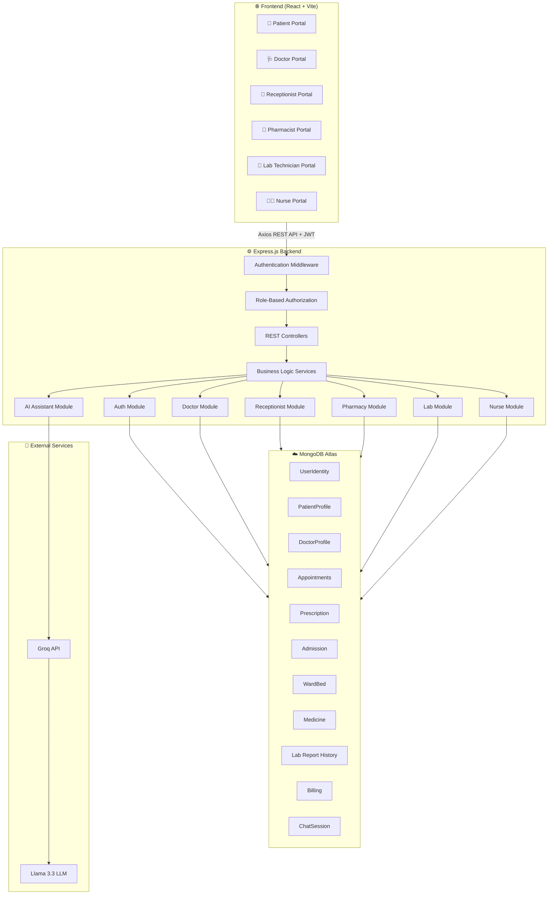
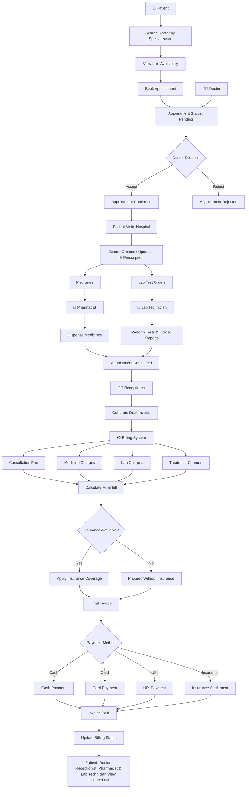
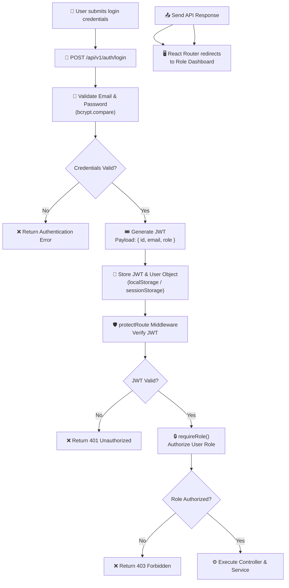
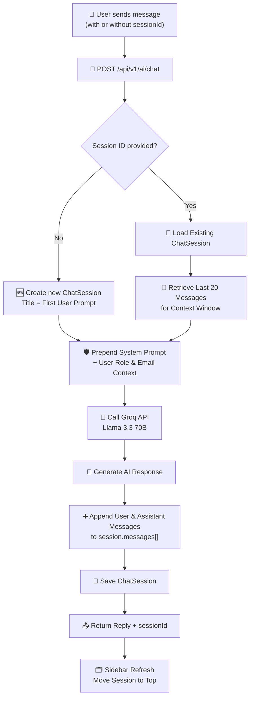

<p align="center">
  
</p>

# <h1 align="center">CareOS — Hospital Management & Operations Platform</h1>

<div align="center">


**A full-stack, role-based Hospital Management System built on the MERN stack**
*Streamlining patient care, clinical workflows, billing, and hospital operations — end to end.*

</div>

---

## 📋 Table of Contents

<details>
<summary><strong>Click to expand</strong></summary>

- [About the Project](#-about-the-project)
- [Internship & Author Details](#-internship--author-details)
- [Key Features](#-key-features)
- [Tech Stack](#-tech-stack)
- [System Architecture](#-system-architecture)
- [Workflow Diagrams](#-workflow-diagrams)
- [Project Structure](#-project-structure)
- [Backend Folder Structure Deep Dive](#-backend-folder-structure-deep-dive)
- [Database Schema Overview](#-database-schema-overview)
- [Getting Started](#-getting-started)
- [Sample API Calls](#-sample-api-calls)

</details>

---

## 📖 About the Project

**CareOS** is an industrial-grade, multi-role hospital management system engineered to digitize and optimize the complete patient care lifecycle—from initial appointment scheduling to final billing reconciliation. Built following modern product development standards, the platform features a robust service-layer architecture, RESTful API endpoints, secure JWT authentication, advanced MongoDB aggregation pipelines, and an integrated AI clinical assistant complete with persistent conversation history.

The platform supports **six distinct user roles** — Patient, Doctor, Receptionist, Pharmacist, Lab Technician, and Nurse — each with a tailored dashboard and permission set, all backed by a single unified backend.

> This project was built as part of an internship engagement to demonstrate full-stack engineering capability across backend architecture, frontend UX, database design, and deployment practices.

---

## 🎓 Internship & Author Details

| Field | Detail |
|---|---|
| **Project Name** | `CareOS Hospital Management ERP System` |
| **Author** | `Het Limbani` |
| **Role** | `MERN Stack Developer` |
| **Institution** | `Adani University` |
| **Internship Company** | [Covrize IT Solutions Private Limited](https://www.covrize.com/) |
| **Duration** | `Summer Internship  June 1, 2026` – `July 26, 2026` |
| **Live Deployment (Frontend)** | `https://careos-healthcare-erpsystem.vercel.app/` |
| **API REFERENCE** | `https://careos-backend.vercel.app/` |

---

## ✨ Key Features

<details>
<summary><strong>🧑‍⚕️ Patient Module</strong></summary>

- Profile management with medical details, emergency contacts, and insurance info
- Search doctors by specialization and view live availability calendars
- Book, reschedule, and cancel appointments in real time (slot-collision safe)
- View complete prescription history with medicine and lab test breakdowns
- Track diagnostic lab report status and results
- Personal clinical dashboard — allergies, chronic conditions, vitals log
- Domain-restricted AI Assistant with persistent, per-user chat history
- Billing history tracking with insurance verification status (verified or pending) and completed billing information details

</details>

<details>
<summary><strong>🩺 Doctor Module</strong></summary>

- Profile & clinic setup (specialization, fee, qualifications, bio)
- Appointment request management (confirm/reject) with monthly calendar view
- Issue & edit e-prescriptions (medicines + lab test orders) linked to catalogs
- Full patient roster with clinical history timeline per patient
- Review completed diagnostic lab reports
- Manage inpatient ward treatment directives and admission plans

</details>

<details>
<summary><strong>💳 Receptionist Module</strong></summary>

- Visited-queue → auto-aggregated draft invoice generation (consultation + treatment + medicine + lab costs)
- Insurance coverage validation and adjustment charge handling
- Partitioned billing ledger: Unpaid / Insurance Pending / Paid / Cancelled
- Invoice status lifecycle management with payment method tracking
- Appointment management with real-time slot booking, rescheduling, and accept/reject request handling backed by automated email notifications
- Admission processing and dynamic room/bed assignment tracking
- Consultation request management handling incoming walk-in or phone schedules with automated email response dispatch

</details>

<details>
<summary><strong>💊 Pharmacist Modules</strong></summary>

- Prescription-linked medicine dispensing and pharmacy invoice generation
- Medicine inventory management with real-time stock updates, low-stock alerts, and new stock batch registration
- Comprehensive pharmacy billing history with status tracking to view paid, pending, and voided bills instantly

</details>

<details>
<summary><strong>🧪 Lab Technician Modules</strong></summary>

- Manage upcoming lab requests
- Lab test request intake, result upload, and status pipeline tracking
- Comprehensive pharmacy billing history with status tracking to view paid, pending, and voided bills instantly

</details>

<details>
<summary><strong>🧑🏼‍⚕️ Nurse Modules</strong></summary>

- Access assigned patient data including prescription record files and lab report files
- Ward management restricted to assigned patients, including tracking status such as ready for discharge
- Record and store vital logs including Blood Pressure, Heart Rate (BPM), and Temperature (°C), and view Historical Evaluation Logs
- Manage treatment plans prescribed by doctors, execute them to completion, and update treatment plan details as a nurse
</details>

<details>
<summary><strong>🤖 CareOS AI Assistant</strong></summary>

- Domain-restricted conversational assistant (hospital ops only — guardrailed system prompt)
- **Persistent chat sessions** stored per authenticated user in MongoDB
- Multi-session history sidebar — resume, rename, or delete past conversations
- Role-aware quick-action suggestions
- Powered by Groq (Llama 3.3 70B) for low-latency inference

</details>

---

## 🛠 Tech Stack

<details>
<summary><strong>Click to expand full stack breakdown</strong></summary>

### Frontend
| Technology | Purpose |
|---|---|
| **React 18** | Component-based UI |
| **Axios** | HTTP client for API communication |
| **React Router** | Client-side routing |
| **Lucide React** | Icon system |
| **Custom CSS (BEM-style modules)** | Styling, no framework lock-in |

### Backend
| Technology | Purpose |
|---|---|
| **Node.js + Express.js** | REST API server |
| **MongoDB + Mongoose** | Primary data store & ODM |
| **JWT** | Stateless authentication |
| **Groq SDK** | LLM inference for the AI Assistant |
| **bcrypt** | Password hashing |

### DevOps / Tooling
| Technology | Purpose |
|---|---|
| **Vercel** | Frontend + serverless backend deployment |
| **MongoDB Atlas** | Managed cloud database |
| **Postman** | API testing & documentation |
| **Git / GitHub** | Version control |

</details>

---

## 🏗 System Architecture



---

## 🔄 Workflow Diagrams

<details>
<summary><strong>1️⃣ Patient Appointment → Consultation → Billing Lifecycle</strong></summary>



</details>

<details>
<summary><strong>2️⃣ Authentication & Role-Based Routing Flow</strong></summary>



</details>

<details>
<summary><strong>3️⃣ AI Assistant Chat Persistence Flow</strong></summary>



</details>

---

## 📁 Project Structure

```
careos-hospital-management/
│
├── Backend/                       # Node.js + Express API server
│   ├── src/
│   │   ├── modules/                # Feature-based module organization
│   │   │   ├── auth/
│   │   │   ├── patients/
│   │   │   ├── doctor/
│   │   │   ├── receptionist/
│   │   │   ├── pharmacist/
│   │   │   ├── nurse/
│   │   │   ├── lab_technician/
│   │   ├── middleware/
│   │   │   ├── authMiddleware.js
│   │   │   └── errorHandler.js
│   │   ├── service/
│   │   │   ├── ai.service.js
│   │   │   └── email.service.js
│   │   ├── utils/
│   │   │   ├── ai.controller.js
│   │   │   └── ai.routes.js
│   │   │   ├── ai.recaptcha.js
│   │   │   └── ...
│   │   ├── config/
│   │   └── app.js
│   ├── .env.example
│   ├── package.json
│   └── vercel.json
│
├── Frontend/                      # React SPA
│   ├── public/
│   ├── src/
│   │   ├── assets/
│   │   ├── modules/
│   │   │   ├── auth/
│   │   │   ├── common/
│   │   │   ├── landing/
│   │   │   ├── patient/
│   │   │   ├── doctor/
│   │   │   ├── receptionist/
│   │   │   ├── pharmacist/
│   │   │   ├── nurse/
│   │   │   ├── lab_technician/
│   │   ├── App.jsx
│   │   └── main.jsx
│   │   ├── App.css
│   │   └── index.css
│   ├── .env.example
│   ├── package.json
│   └── vite.config.js
├── CareOS-Hospital_ERP_System.xlsx
└── README.md
```

---

## 🔍 Backend Folder Structure Deep Dive

<details>
<summary><strong>Backend: modules/ (feature-sliced architecture)</strong></summary>

Each module follows a consistent 4-file pattern for separation of concerns:

```
modules/<feature>/
├── <feature>.model.js         # Mongoose schema
├── <feature>.service.js       # Business logic, DB queries (pure functions)
├── <feature>.controller.js    # Request/response handling, calls service
└── <feature>.routes.js        # Express router, wires middleware + controller
```

**Why this pattern?**
- **Testability** — services are pure functions, easy to unit test without HTTP mocking
- **Reusability** — services can be called from multiple controllers (e.g. AI assistant querying billing service)
- **Scalability** — new features are additive folders, not edits to a monolithic file

Example — `receptionist/` module:
```
receptionist/
├── billing.model.js           # Billing schema (items, status, insurance)
├── billing.service.js         # aggregateDraftInvoiceData(), saveConfirmedLedgerBill()...
├── billing.controller.js      # HTTP handlers
└── billing.routes.js          # /api/v1/receptionist/* routes
```

</details>

---

## 🗄 Database Schema Overview

<details>
<summary><strong>Core Collections</strong></summary>

| Collection | Purpose | Key Relationships |
|------------|---------|-------------------|
| `UserIdentity` | Stores authentication, user credentials, and role information for all system users. | Parent collection for all user profiles |
| `PatientProfile` | Stores patient demographics, insurance, emergency contacts, and personal information. | `patient_id → UserIdentity` |
| `DoctorProfile` | Stores doctor profile details, specialization, qualifications, clinic information, and consultation fee. | `doctor_id → UserIdentity` |
| `DoctorConfig` | Defines the doctor's default weekly availability and appointment time slots. | `doctor_id → UserIdentity` |
| `DoctorOverrides` | Stores custom schedules, leave days, holidays, and overridden appointment slots. | `doctor_id → UserIdentity` |
| `PatientConsultation` | Stores patient consultation requests submitted through the website. | Independent collection |
| `Appointment` | Manages appointment bookings, scheduling, and appointment lifecycle. | `patient_id`, `doctor_id → UserIdentity` |
| `Prescription` | Stores doctor diagnosis, medicines, lab test requests, and treatment notes. | `appointmentId → Appointment` |
| `Medicines` | Master catalog of medicines including pricing, stock, barcode, and composition. | Referenced by `Prescription` & `PharmacyInvoice` |
| `LabReports` | Master catalog of diagnostic laboratory tests and pricing. | Referenced by `Prescription` & `LabReportHistory` |
| `MedicineHistory` | Tracks dispensed medicines, pharmacist actions, skipped medicines, and payment status. | `prescriptionId`, `appointmentId`, `patientId` |
| `LabReportHistory` | Tracks laboratory workflow, requested tests, generated reports, billing, and technician activity. | `prescriptionId`, `appointmentId`, `patientId` |
| `PharmacyInvoice` | Stores medicine invoices, dispensed items, payment status, and pharmacy billing records. | `prescriptionId`, `appointmentId`, `patientId` |
| `WardBeds` | Maintains hospital room and bed availability with occupancy status. | `currentAdmissionId → Admission` |
| `Admissions` | Stores inpatient admission records, assigned beds, nurses, and hospitalization details. | `patientId`, `bedId`, `prescriptionId` |
| `TreatmentPlans` | Stores inpatient treatment plans, scheduled procedures, medications, and nursing tasks. | `admissionId`, `patientId` |
| `Billing` | Centralized billing system combining consultation, pharmacy, laboratory, treatment, insurance, and payment information. | `appointmentId`, `patientId`, `doctorId`, `receptionistId` |
| `PatientDashboard` | Stores patient vitals, allergies, chronic diseases, and health monitoring history. | `patient_id → UserIdentity` |
| `ChatSession` | Stores persistent AI chatbot conversations, message history, and session metadata. | `userEmail → UserIdentity` |

</details>

---

## 🚀 Getting Started

### Prerequisites
```bash
node >= 18.x
npm >= 9.x
MongoDB Atlas account (or local MongoDB instance)
Groq API key (for AI Assistant feature)
```

### Installation

<details>
<summary><strong>1. Clone the repository</strong></summary>

```bash
git clone https://github.com/HetLimbani-learnerboy/CareOS.git
cd CareOS
```

</details>

<details>
<summary><strong>2. Backend setup</strong></summary>

```bash
cd Backend
npm install
cp .env.example .env
# Fill in your MongoDB URI, JWT secret, Groq API key
npm start
```

Server runs on `http://localhost:8000` by default.

</details>

<details>
<summary><strong>3. Frontend setup</strong></summary>

```bash
cd Frontend
npm install
cp .env.example .env
# Set VITE_API_BASE_URL=http://localhost:8000
npm run dev
```

App runs on `http://localhost:5173` by default.

</details>

---

## 📡 Sample API Calls

<details>
<summary><strong>🔑 Login</strong></summary>

**Request**
```http
POST /api/v1/auth/login
Content-Type: application/json

{
  "email": "doctor@careos.com",
  "password": "Temp1234!",
  "captchaToken": "<enter_reCAPTCHA_response_token_here>",
  "rememberMe": true
}
```

**Response**
```json
{
    "status": "success",
    "user": {
        "_id": "**",
        "firstName": "Rohan",
        "lastName": "Joshi",
        "email": "doctor@careos.com",
        "countryCode": "+91",
        "phone": "909090909",
        "role": "doctor",
        "profile_image": null,
        "is_verified": true,
        "createdAt": "2026-06-18T16:19:21.449Z",
        "updatedAt": "2026-06-19T00:15:53.723Z",
        "id": 107,
        "__v": 0
    },
    "token": "ey..."
}
```

</details>


